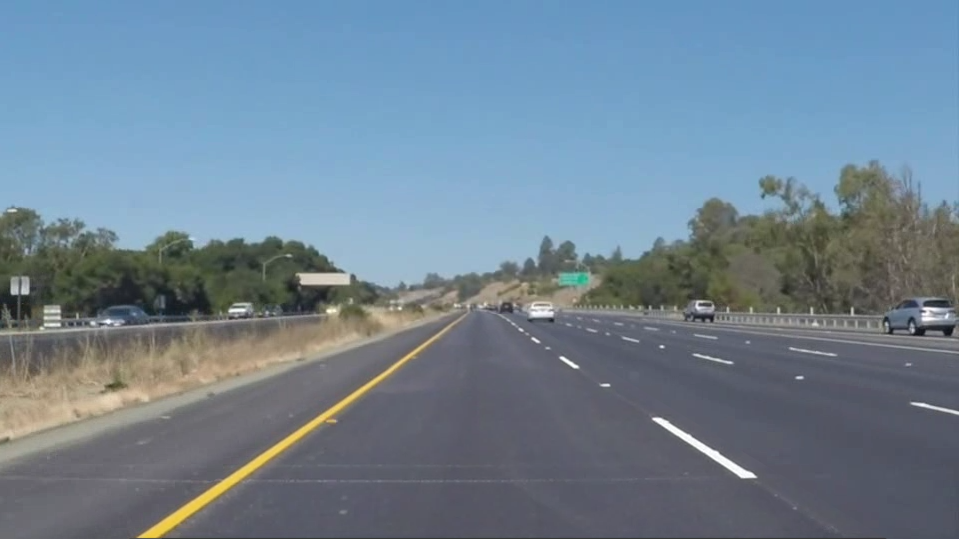
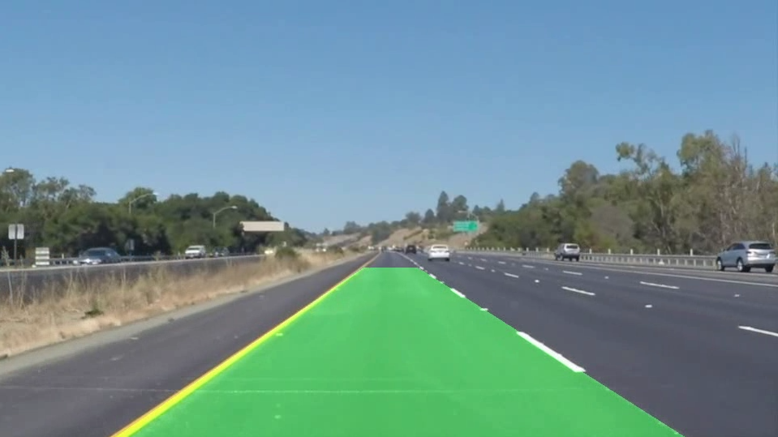

# Lane Detection using Hough Transform in OpenCV

## Overview

This Jupyter Notebook project demonstrates lane detection in videos using Hough Transform in OpenCV. The current implementation is designed to work with straight lanes, so it may not handle curved roads effectively. 

## Demo output images

 